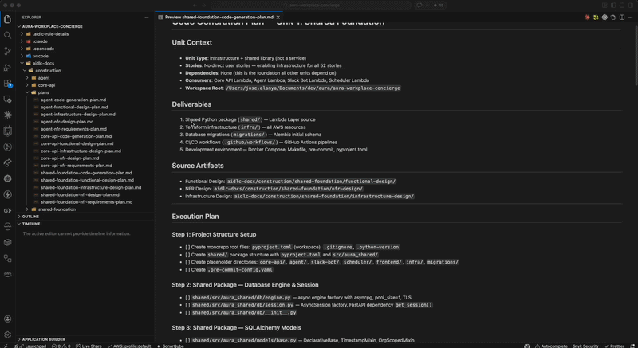

# aidlc-linear

A skill plugin that converts [AI-DLC](https://github.com/awslabs/aidlc-workflows) code generation plans into Linear tasks, organized by deliverable-based projects with full context for agent delegation.



## What It Does

Takes a code generation plan produced by the AI-DLC Construction phase and creates:

- **Deliverable-based projects** in Linear (e.g., "Shared Foundation: Application Code", "Core API: Unit Tests")
- **Fully-described tasks** with objective, design references, files to create, dependencies, patterns, stories, and acceptance criteria
- **Story ID labels** with color-coded epic groups (check-and-create-if-missing)
- **Task dependencies** linked via Linear's issue relations

Each task contains enough context to be delegated to an AI agent or developer without additional briefing.

## Installation

### Claude Code

```bash
claude plugin install jalanya/aidlc-linear --scope project
```

Or load directly during development:

```bash
claude --plugin-dir /path/to/aidlc-linear
```

### Opencode

Copy the skill into your project or global config:

```bash
# Project-level (recommended)
cp -r /path/to/aidlc-linear/skills/create-unit-tasks .opencode/skills/create-unit-tasks

# Global
cp -r /path/to/aidlc-linear/skills/create-unit-tasks ~/.config/opencode/skills/create-unit-tasks
```

Or clone the repo and symlink:

```bash
git clone https://github.com/jalanya/aidlc-linear.git ~/.local/share/aidlc-linear
ln -s ~/.local/share/aidlc-linear/skills/create-unit-tasks .opencode/skills/create-unit-tasks
```

## Usage

```
/aidlc-linear:create-unit-tasks <unit-name> in <team-name>
```

### Examples

```
/aidlc-linear:create-unit-tasks shared-foundation in aura-core
/aidlc-linear:create-unit-tasks core-api in aura-core --dry-run
/aidlc-linear:create-unit-tasks agent in my-team
```

### Arguments

| Argument | Required | Description |
|----------|----------|-------------|
| `unit-name` | Yes | Unit name matching the plan filename (e.g., `shared-foundation`, `core-api`, `agent`) |
| `team-name` | Yes | Linear team name to create tasks in |
| `--dry-run` | No | Preview what would be created without calling Linear APIs |

## Prerequisites

1. **AI-DLC project structure** with:
   - Code generation plan at `aidlc-docs/construction/plans/{unit-name}-code-generation-plan.md`
   - User stories at `aidlc-docs/inception/user-stories/stories.md`

2. **Linear MCP server** configured in your Claude Code or Opencode setup

## How It Works

1. **Parses** the code generation plan to extract steps, files, stories, and dependencies
2. **Derives** a 2-letter task prefix from the unit name (SF, CA, AG, SB, SC, FE)
3. **Groups** steps into deliverable-based projects using keyword matching
4. **Creates labels** for referenced story IDs (check-and-create-if-missing, color-coded by epic)
5. **Creates projects** per deliverable group
6. **Creates tasks** with rich descriptions following a consistent template
7. **Sets dependencies** between tasks based on step ordering
8. **Reports** a summary of everything created

## Task Description Template

Each task includes:

- **Objective** — What to build
- **Design References** — Which AI-DLC artifacts to read
- **Files to Create** — Exact paths from the plan
- **Dependencies** — Which tasks block / are blocked by this one
- **Key Patterns & Decisions** — Relevant NFR patterns
- **Stories Enabled** — User stories this task implements
- **Acceptance Criteria** — How to verify completion

## License

MIT
